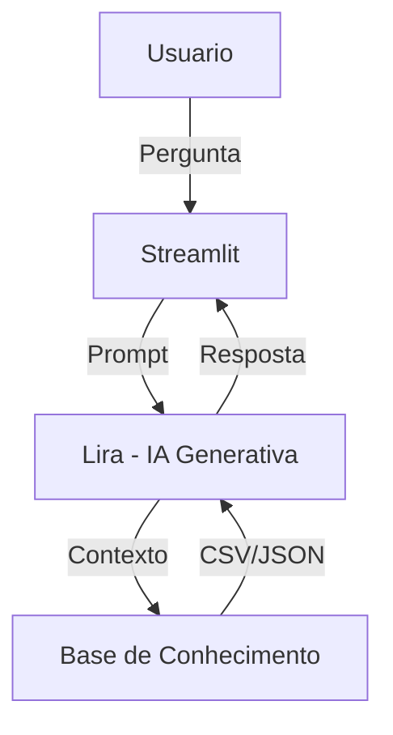

# 📊 Lira — Agente Analista de Dados com IA Generativa (Ollama Local)

## Contexto

Assistentes baseados em IA estão evoluindo de simples chatbots para **agentes analíticos especializados**, capazes de interpretar dados estruturados, aplicar regras explícitas e gerar insights confiáveis sem alucinações.

Neste projeto, foi desenvolvido o **Lira**, um **Agente Analista de Dados** que utiliza **IA Generativa rodando localmente via Ollama**, com foco em:

* Análise exploratória de dados estruturados (CSV)
* Aplicação de métricas e regras previamente definidas
* Explicação clara do raciocínio analítico
* Segurança contra alucinações (respostas restritas à base de dados)

O agente **não toma decisões estratégicas**, **não cria dados** e **não utiliza conhecimento externo**.

---

## 🎯 Objetivo do Agente

O Lira foi projetado para atuar como um **analista de dados júnior assistido por IA**, capaz de:

* Responder perguntas analíticas sobre dados operacionais e de vendas
* Aplicar métricas autorizadas de forma consistente
* Identificar distribuições, volumes e comparações simples
* Informar limitações quando os dados são insuficientes

---

## 🧠 Persona e Tom de Voz

* **Nome:** Lira
* **Função:** Agente Analista de Dados
* **Tom:** Profissional, didático e objetivo
* **Comportamento:**

  * Amigável em saudações
  * Técnico e explicativo em análises
  * Transparente quanto a limitações dos dados

---

## 🏗️ Arquitetura da Solução



### Componentes:

* **Interface:** Streamlit (chat interativo)
* **LLM:** Modelo local via Ollama
* **Base de conhecimento:** Arquivos CSV e JSON
* **Controle de comportamento:** System Prompt estruturado

---

## 📁 Base de Conhecimento

Os dados utilizados pelo agente são **mockados e controlados**, garantindo previsibilidade e segurança.

| Arquivo                 | Formato | Descrição                        |
| ----------------------- | ------- | -------------------------------- |
| `dataset.csv`           | CSV     | Dados operacionais e de vendas   |
| `dicionario_dados.json` | JSON    | Significado e regras das colunas |
| `metricas_analise.json` | JSON    | Métricas autorizadas             |
| `regras_analista.json`  | JSON    | Restrições de atuação do agente  |

🔒 O agente **não pode analisar dados fora desses arquivos**.

---

## 🧩 Prompts do Agente

O comportamento do Lira é controlado por um **System Prompt robusto**, que define:

* Classificação da mensagem do usuário:

  * Saudação
  * Pergunta fora de escopo
  * Pergunta válida de análise
* Regras obrigatórias de análise
* Formato padrão de resposta
* Tratamento de edge cases

📄 Detalhamento disponível em:
`docs/03-prompts.md`

---

## 🖥️ Aplicação Funcional

O projeto conta com um **chat interativo funcional**, desenvolvido em Streamlit, com:

* Histórico de conversa
* Spinner de análise
* Tratamento de erros de conexão com o modelo
* Execução local (sem dependência de APIs externas)

Para rodar o projeto:

```bash
ollama run phi3
streamlit run src/app.py
```

---

## 📊 Avaliação e Métricas

A qualidade do agente é avaliada com base em:

* **Aderência aos dados** (zero alucinação)
* **Uso correto das métricas autorizadas**
* **Clareza na explicação do raciocínio**
* **Capacidade de reconhecer limitações**

📄 Mais detalhes em:
`docs/04-metricas.md`

---

## 🎤 Pitch (Resumo)

> “O Lira é um agente analista de dados que utiliza IA Generativa local para transformar dados estruturados em análises confiáveis, seguindo regras explícitas e evitando alucinações. Ele atua como um analista assistido, explicando cada passo do raciocínio e respeitando rigorosamente a base de dados fornecida.”

---

## 📂 Estrutura do Repositório

```
📁 lira-agente-analista-dados/
│
├── 📄 README.md
│
├── 📁 data/
│   ├── dataset.csv
│   ├── dicionario_dados.json
│   ├── metricas_analise.json
│   └── regras_analista.json
│
├── 📁 docs/
│   ├── 01-documentacao-agente.md
│   ├── 02-base-conhecimento.md
│   ├── 03-prompts.md
│   ├── 04-metricas.md
│   └── 05-pitch.md
│
├── 📁 src/
│   └── app.py
│
└── 📁 assets/
```

---

## ✅ Considerações Finais

* O projeto prioriza **segurança e controle**
* O agente não substitui um analista humano
* O foco está em **confiabilidade**, não em criatividade
* O uso de IA local garante **privacidade e autonomia**

---
